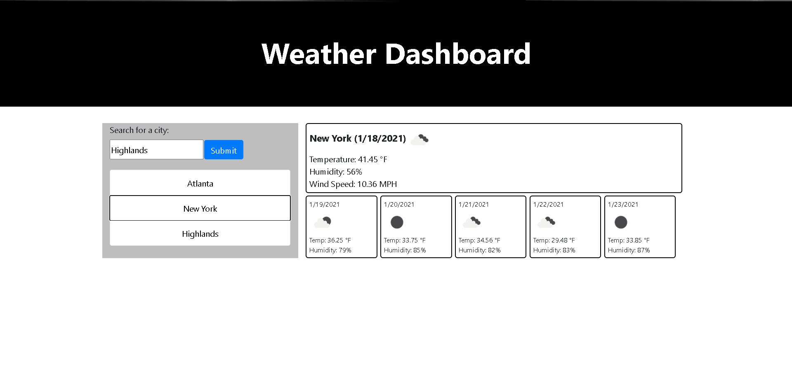
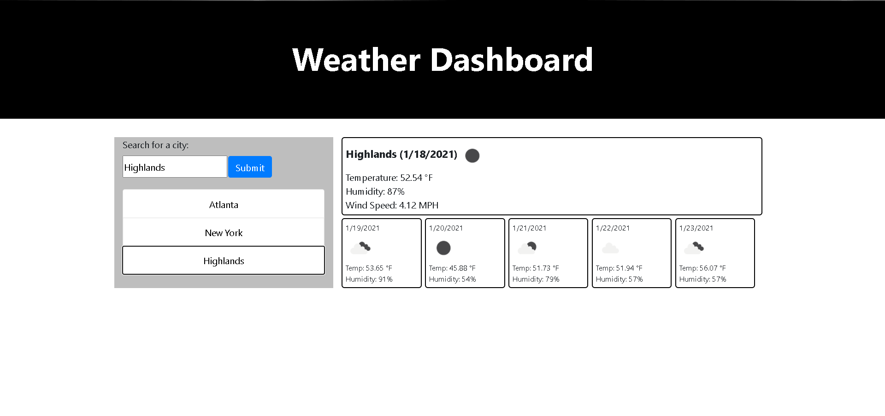

# Weather-Dashboard

## Application Link

https://john-paul-grace.github.io/Weather-Dashboard/

## Repository Link

https://github.com/John-Paul-Grace/Weather-Dashboard

## Description

An app that allows users to add cities to a list and check the weather for those cities. Cities are not stored in local storage, so refreshing the page resets the list. Weather for the current day and for five days after are displayed.

## User Story

```
AS A traveler
I WANT to see the weather outlook for multiple cities
SO THAT I can plan a trip accordingly
```

## Screenshots


---

---


## Contributions

The HTML, CSS, and JavaScript were all written by me. The OpenWeatherMap API was used to get the weather information.
